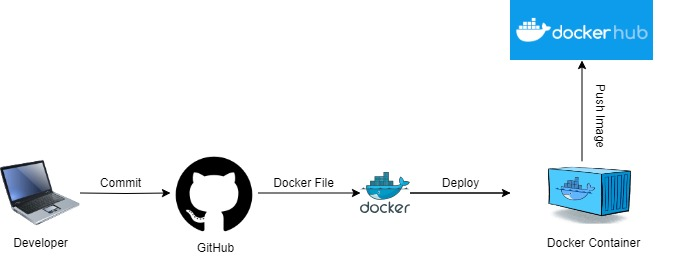
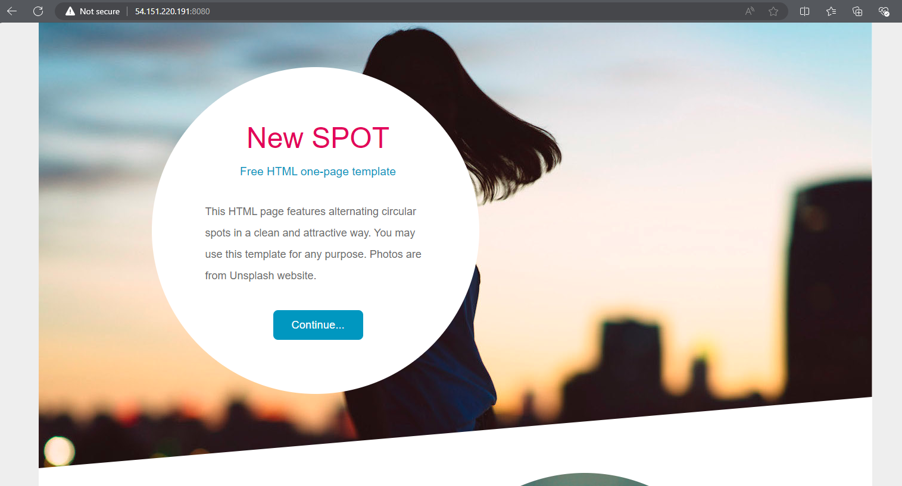
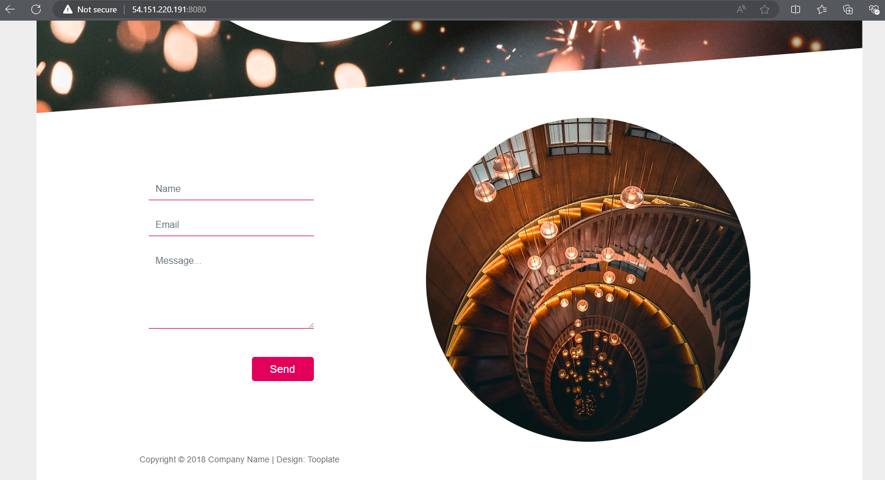

<h3 align="center">Static Website Docker Setup</h3>

  

  🔭 Deploying a static website using Docker

<h3 align="left">Architecture Diagram</h3>

  <!-- Add links to your social profiles here -->
  <!-- Example:
  <a href="https://twitter.com/yourusername" target="_blank" rel="noreferrer">Twitter</a> |
  <a href="https://linkedin.com/in/yourusername" target="_blank" rel="noreferrer">LinkedIn</a>
  -->

<h3 align="left">Languages and Tools:</h3>

  
  
  
  
  
  
  

<h3 align="left">Project Overview</h3>

  This repository contains the setup for a static website using Docker. It includes instructions for building and running the Docker image and pushing it to Docker Hub. The static website serves HTML, CSS, and JavaScript files using Nginx.

<h3 align="left">Table of Contents</h3>

<ul>
  <li><a href="#introduction">Introduction</a></li>
  <li><a href="#prerequisites">Prerequisites</a></li>
  <li><a href="#setup">Setup</a></li>
  <li><a href="#building-the-docker-image">Building the Docker Image</a></li>
  <li><a href="#running-the-docker-container">Running the Docker Container</a></li>
  <li><a href="#pushing-the-docker-image-to-docker-hub">Pushing the Docker Image to Docker Hub</a></li>
  <li><a href="#accessing-the-website">Accessing the Website</a></li>
  <li><a href="#troubleshooting">Troubleshooting</a></li>
   <li><a href="#screenshots">Screenshots</a></li>
</ul>

<h3 align="left">Introduction</h3>

  This project demonstrates how to containerize a static website using Docker. It leverages Nginx as the web server and provides a simple way to deploy and manage static content in a Docker environment.

<h3 align="left">Prerequisites</h3>

  Before you begin, ensure you have the following installed:

<ul>
  <li><a href="https://docs.docker.com/get-docker/" target="_blank" rel="noreferrer">Docker</a>: Follow the installation instructions for your operating system.</li>
  <li><a href="https://hub.docker.com/" target="_blank" rel="noreferrer">Docker Hub Account</a>: You’ll need this to push your Docker image.</li>
</ul>

<h3 align="left">Setup</h3>

<ol>
  <li>
    <strong>Clone the Repository</strong>
    

      First, clone this repository to your local machine:
    

    <pre><code>git clone https://github.com/JoelThomas20/StaticWebsite.git
cd static-website-docker</code></pre>
  </li>
  <li>
    <strong>Add Your Static Website Files</strong>
    

      Place your static website files (e.g., <code>index.html</code>, <code>styles.css</code>, <code>scripts.js</code>) in the <code>website</code> directory.
    

    
Directory structure should look like:

    <pre><code>static-website-docker/
├── Dockerfile
└── website/
    ├── index.html
    ├── Styles 
    └── styles.css
    ├── Scripts
    └── scripts.js</code></pre>
  </li>
</ol>

<h3 align="left">Building the Docker Image</h3>

  To build the Docker image for your static website, use the following command:

<pre><code>docker build -t staticwebsite .</code></pre>

  <code>-t staticwebsite</code>: Tags the image with the name <code>staticwebsite</code>.

<h3 align="left">Running the Docker Container</h3>

  Run the Docker container using the following command:

<pre><code>docker run -d -p 8080:80 --name my-static-website staticwebsite</code></pre>
<ul>
  <li><code>-d</code>: Runs the container in detached mode.</li>
  <li><code>-p 8080:80</code>: Maps port 80 in the container to port 8080 on your host machine.</li>
  <li><code>--name my-static-website</code>: Assigns a name to the container.</li>
  <li><code>staticwebsite</code>: The name of the image to use.</li>
</ul>

<h3 align="left">Pushing the Docker Image to Docker Hub</h3>

<ol>
  <li>
    <strong>Commit the Running Container to an Image</strong>
    

      If you made changes and want to save them, commit the container:
    

    <pre><code>docker commit my-static-website my-static-website-image</code></pre>
  </li>
  <li>
    <strong>Tag the Image for Docker Hub</strong>
    

      Tag the image with your Docker Hub repository:
    

    <pre><code>docker tag my-static-website-image yourusername/staticwebsite:latest</code></pre>
    
Replace <code>yourusername</code> with your Docker Hub username and <code>my-static-website</code> with your repository name.

  </li>
  <li>
    <strong>Log In to Docker Hub</strong>
    

      Log in to your Docker Hub account:
    

    <pre><code>docker login</code></pre>
  </li>
  <li>
    <strong>Push the Image to Docker Hub</strong>
    

      Push the tagged image to Docker Hub:
    

    <pre><code>docker push yourusername/staticwebsite:latest</code></pre>
  </li>
</ol>

<h3 align="left">Accessing the Website</h3>

  After running the container, you can access your static website by opening a web browser and navigating to:

<pre><code>http://localhost:8080</code></pre>

<h3 align="left">Troubleshooting</h3>

<ul>
  <li><strong>Container Not Running:</strong> Check the container status with <code>docker ps</code>. If not running, view logs with <code>docker logs my-static-website</code>.</li>
  <li><strong>Permission Issues:</strong> Ensure Docker is running with appropriate permissions. Use <code>sudo</code> if necessary.</li>
  <li><strong>Port Conflicts:</strong> Ensure port 8080 on your host machine is not in use by another application.</li>
</ul>

<h3 align="left">Screenshots</h3>

